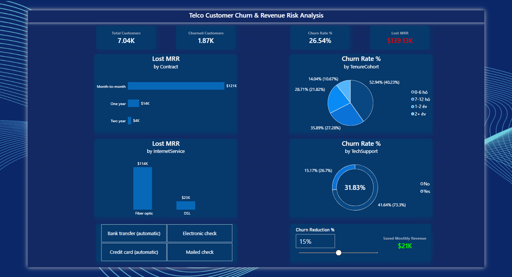

# 📊 Telco Customer Churn & Revenue Risk Analysis

An end-to-end data analysis project focusing on customer attrition patterns and monthly revenue impact for a telecommunications dataset. 

The data was transformed and analyzed using **DuckDB SQL**, with key business insights visualized through an interactive executive **Power BI** dashboard equipped with a dynamic retention simulator.

---

## 🎯 The Business Problem

In the telecommunications sector, acquiring new customers costs significantly more than retaining existing ones. Prior to this analysis, management lacked unified visibility into customer attrition and its financial toll:

* **Severe Revenue Drain:** Customer churn stands at **26.54%** (1,869 churned accounts out of 7,043).
* **Direct Financial Loss:** This attrition directly causes **$139,130 in Lost Monthly Recurring Revenue (Lost MRR)**, which accounts for **30.5%** of the company’s total monthly baseline revenue ($456.12K).
* **Unfocused Retention:** The business needed clear visibility into which specific service tiers and contract types bleed the most revenue, and what financial return could be expected from targeted retention efforts.

---

## 💡 Key Business Questions Answered by the Dashboard

The dashboard provides immediate strategic answers to 5 core business questions:

1. **Where is revenue bleeding the most? (Contract Risk)**
   * **Answer:** **Month-to-month contracts**. While making up ~55% of the total customer base, they account for **86.9% ($120.8K/month)** of all lost revenue with a **42.71%** churn rate. In contrast, 2-year contract churn is negligible at 2.83%.
2. **Which infrastructure tier carries the highest operational risk?**
   * **Answer:** **Fiber Optic Internet**. Despite being a premium service, Fiber users experience a **41.89%** churn rate ($114.3K lost MRR), compared to only 18.96% for DSL subscribers.
3. **When is an account most vulnerable? (Intervention Window)**
   * **Answer:** During the **first 6 months**. The 0–6 month onboarding cohort experiences a **52.9%** churn rate. Once an account reaches 24+ months, churn drops below 14%.
4. **Does auxiliary service affect retention?**
   * **Answer:** Yes. Customers without **Tech Support** churn at **41.6%**, compared to only **15.2%** for customers with active support.
5. **What is the expected ROI of a retention campaign? (What-If Simulation)**
   * **Answer:** Using the interactive sensitivity slider, achieving a 15% churn reduction preserves ~$21K/month (over $250K annually) in recurring revenue.

---

## 🖥️ Executive Dashboard Preview

### Dashboard Features & Components:
* **Executive Scorecards (KPIs):** Instant visibility into `Total Customers` (7,043), `Churned Customers` (1,869), `Churn Rate %` (26.54%), and `Lost MRR` ($139.13K).
* **Financial Risk Visuals:** Lost MRR segmented by Contract Type and Internet Service.
* **Lifecycle Cohort Analysis:** Visualizing attrition distribution across customer lifecycle stages (`TenureCohort`).
* **Interactive Slicers:** Filtering capability by `PaymentMethod`.
* **Dynamic What-If Parameter:** Real-time simulation using `Churn Reduction %` to compute projected `Saved Monthly Revenue`.

---

## 📋 Strategic Recommendations (Action Plan)

Based on data evidence, the company should implement the following steps:
1. **Incentivize Term Commitments:** Introduce discounted annual packages or bundle incentives to migrate Month-to-month users onto 1- or 2-year contracts.
2. **Launch a 90-Day Onboarding Protocol:** Focus customer success resources on the first 3–6 months to mitigate early-stage churn.
3. **Bundle Tech Support with Fiber Optic:** Mitigate high fiber optic churn by packaging complimentary tech support during the initial service period.

---

## 🛠️ Data Pipeline & Technical Workflow

### 1. DuckDB / SQL Pipeline (`telco_churn.sql`)
- Queried the raw dataset directly using DuckDB's `read_csv` function.
- Cleaned whitespace in `TotalCharges` and safely cast values to numeric types, handling zero-tenure customer records.
- Engineered categorical cohorts (`TenureCohort`: 0-6 months, 7-12 months, 1-2 years, 2+ years).
- Created binary flags (`ChurnFlag`) for optimized aggregation performance.
- Exported the transformed data to `telco_churn_cleaned.csv`.
